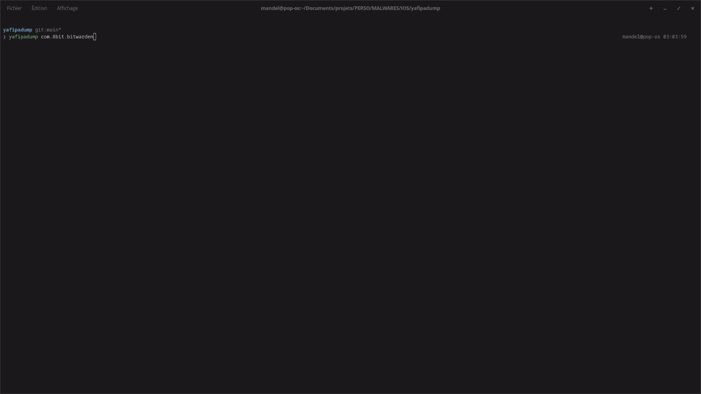

# yafipadump

Yet Another Frida IPA Dump - a FairPlay DRM dumper for jailbroken iOS devices.

Built because existing dumpers (flexdecrypt, bfdecrypt, CrackerXI, bagbak, etc.) write the decrypted binary directly on the device, which is brittle on **rootless Dopamine** jailbreaks due to permission constraints between the sandboxed app process and the dumper's write paths. On my setup, none of them could write successfully. yafipadump sidesteps the issue entirely by reading the decrypted bytes from process memory via Frida, pulling the `.app` bundle over SSH (`scp`), and patching the binary on the host machine instead.

Also a learning project - an excuse to dig into Mach-O internals, XNU's FairPlay decryption pipeline, and Frida's RPC bridge.



## How it works

```
┌─────────────────── iOS Device ───────────────────┐
│                                                   │
│   App process (spawned by Frida, suspended)       │
│   ┌───────────────────────────────────────────┐   │
│   │  dyld loads binary → kernel decrypts      │   │
│   │  FairPlay pages via apple_protect_pager   │   │
│   │                                           │   │
│   │  Frida agent (TypeScript) reads           │   │
│   │  mach_header_64 → load commands →         │   │
│   │  LC_ENCRYPTION_INFO_64 → readByteArray()  │   │
│   │  on the decrypted zone                    │   │
│   └──────────────────┬────────────────────────┘   │
│                      │ RPC (metadata + bytes)     │
└──────────────────────┼────────────────────────────┘
                       │
          scp pulls .app bundle
                       │
┌──────────────────────▼────────────────────────────┐
│                Host machine                       │
│                                                   │
│  Python orchestrator:                             │
│   1. Patches cryptid → 0 in LC_ENCRYPTION_INFO    │
│   2. Overwrites encrypted zone with dumped bytes  │
│   3. Verifies integrity (SHA-256)                 │
│                                                   │
│  Result: fully decrypted .app bundle              │
│  ready for Hopper / Ghidra / class-dump / dsdump  │
└───────────────────────────────────────────────────┘
```

### Two-phase dump (memory optimization)

Frida's RPC bridge can only transfer one `ArrayBuffer` per call. To avoid loading all modules' decrypted data into memory at once, the dump is split into two phases:

1. **Discovery** (`prepareTheExtraction`) - enumerate modules in the `.app` bundle, store lightweight `Module` references only (no memory copy)
2. **Dump** (`dumpModules(i)`) - for each module, parse its Mach-O header and `readByteArray()` the decrypted zone one at a time

Peak memory usage on the device = one module's decrypted section at a time.

## Requirements

- A **jailbroken iOS device** reachable via USB (Frida must be installed on it)
- **SSH access** to the device, configured in `~/.ssh/config` (default hostname: `6s`, override with `--host`)
- Python 3.12+
- Node.js (for building the TypeScript agent)

## Setup

```bash
# Python dependencies
uv sync

# TypeScript agent
npm install
npm run build    # compiles agent/dumper.ts → _agent.js
```

## Usage

```bash
python -m yafipadump com.example.MyApp
```

Or, after `uv pip install -e .`:

```bash
yafipadump com.example.MyApp
```

Options:

```
yafipadump [-a AGENT_PATH] [--host HOSTNAME] bundle_id

positional arguments:
  bundle_id             iOS bundle identifier (e.g. com.example.MyApp)

options:
  -a, --agent PATH      path to compiled Frida agent (default: _agent.js)
  --host HOSTNAME       SSH hostname of the device (default: 6s)
```

The decrypted `.app` bundle is written to `./dump/<AppName>.app/`.

## Project structure

```
yafipadump/              Python package
  __init__.py
  __main__.py            Entrypoint (python -m yafipadump)
  yafi.py                Yafi class - orchestrates the full pipeline
  frida_api.py           Typed wrapper around Frida's RPC exports
  shared_types.py        TypedDict mirrors of the TS interfaces
  macho.py               Mach-O parse/hash/patch on disk (lief)
  disasm.py              ARM64 disassembly (Capstone) + dump.bin/dump.asm
  report.py              Rich reporting for patch stages
  log.py                 Colored logging helpers (Rich)

agent/                   Frida agent (TypeScript → JS)
  dumper.ts              Injected into the iOS process
  macho.ts               Mach-O constants and struct layouts (from loader.h)
  shared.ts              Shared interfaces (ModuleMetaData, etc.)
  helpers.ts             Utility functions (dirname, error formatting)
```

## XNU references

The agent code is annotated with references to the XNU kernel source, particularly:

- `EXTERNAL_HEADERS/mach-o/loader.h` - `mach_header_64`, load commands, `encryption_info_command_64`
- `bsd/sys/mman.h` - cryptid constants: `CRYPTID_APP_ENCRYPTION` (1), `CRYPTID_MODEL_ENCRYPTION` (2, for CoreML models)
- `osfmk/vm/vm_protos.h` - `vm_map_apple_protected()`, the kernel entry point for FairPlay decryption
- `osfmk/kern/page_decrypt.h` - `text_crypter_create_hook_t`, the hook FairPlay kext registers

## License

ISC
